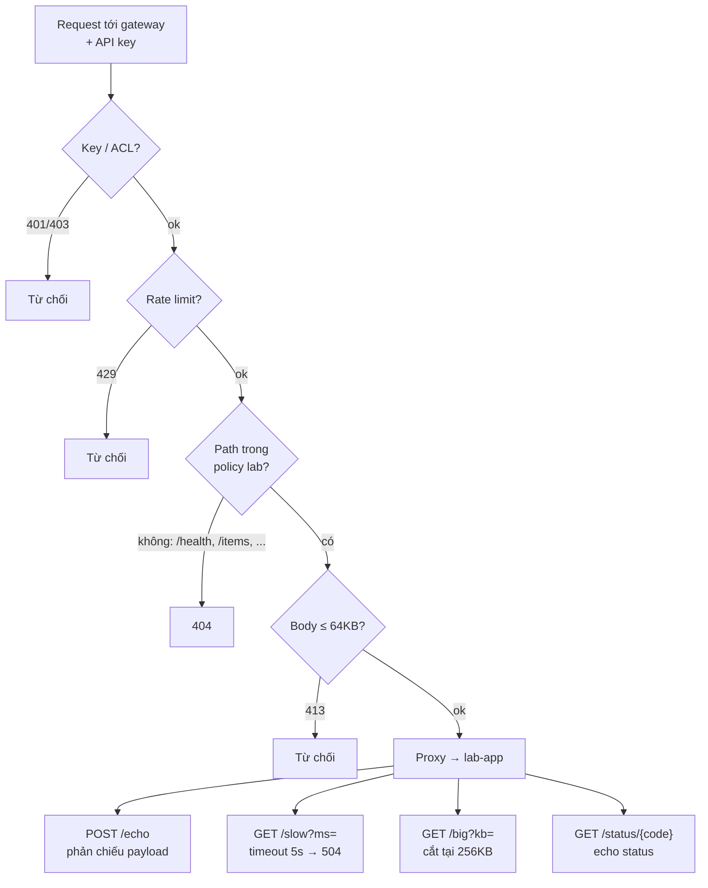
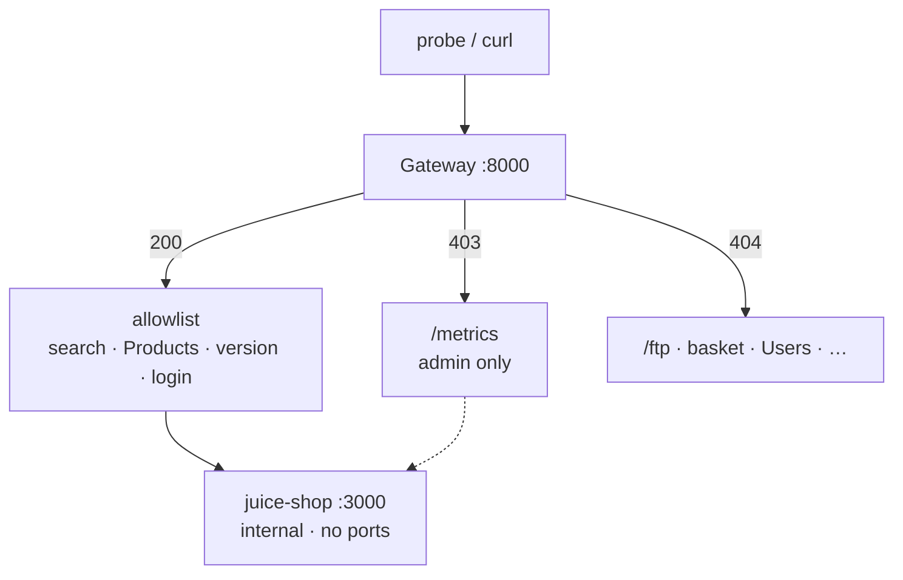
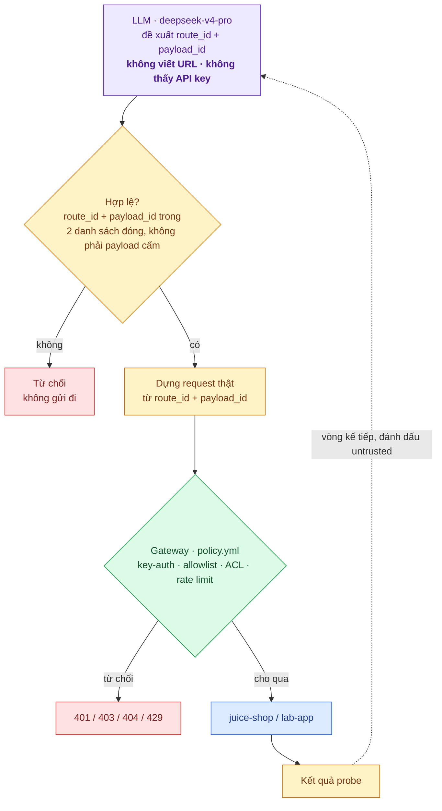

# Báo cáo Tuần 4 — API Gateway và kiểm thử request an toàn

Live demo: [https://ui-production-75e7.up.railway.app/](https://ui-production-75e7.up.railway.app/)

## Mục tiêu

Cho phép Agent (LLM) **đề xuất** một request kiểm thử an toàn, và một Python Tool **gửi** request đó tới ứng dụng thử nghiệm — nhưng luôn thông qua một API Gateway đứng giữa, chưa bao giờ đi thẳng. Agent không viết URL, không thấy API key; nó chỉ chọn một `route_id` và một `payload_id` từ hai danh sách đóng do gateway và tool công bố.

## 1. Công việc đã thực hiện

### 1.1. API Gateway trước ứng dụng thử nghiệm

Gateway tự viết (`gateway/app.py`), không dùng Kong/Nginx — lý do: cần cắt response ở đúng số byte (`max_response_bytes`), việc plugin có sẵn của Kong OSS không hỗ trợ; xem `docs/adr/0001-gateway-tu-viet.md`. Code gateway generic, mọi quyết định (allowlist, rate limit, timeout, kích thước, consumer/ACL) nằm trong `gateway/policy.yml`, không hard-code trong `app.py`.

Docker Compose dựng 3 image:

- **w4-gateway** — tại `./gateway`, cổng 8000, cổng duy nhất publish ra host.
- **w4-lab-app** — tại `./targets/lab-app`, cổng 8080, FastAPI tự viết để kiểm thử.
- **w4-juice-shop** — image có sẵn `bkimminich/juice-shop:latest`, cổng 3000.

Cả `lab-app` và `juice-shop` chỉ chạy trên `internal network`, không publish port ra host — mọi giao tiếp bắt buộc phải đi qua gateway. Chi tiết và bằng chứng ở [§7](#7-chi-tiết-lab-app) và [§8](#8-chi-tiết-juice-shop).

### 1.2. API key và allowlist

- Mỗi consumer có một API key riêng, đọc từ biến môi trường (`PROBE_API_KEY` cho `agent-tool`, `PROBE_ADMIN_KEY` cho `admin-tool`), không ghi cứng trong `policy.yml`.
- Consumer thuộc `group` nào chỉ gọi được route cùng group (ACL) — ví dụ `agent-tool` (group `probe`) không gọi được `/metrics` (group `admin`) dù route đó có tồn tại → **403**, phân biệt được với route không tồn tại trong policy → **404**.
- `routes` trong `policy.yml` là danh sách đóng theo `id + method + path`; bất cứ path nào không khai báo đều trả **404**, không có wildcard.

### 1.3. Python Tool (`src/safe_probe`)

Tool CLI (`safe_probe.cli`) hỗ trợ:

- `get` — gửi `GET`, có thể kèm payload trong query string.
- `post` — gửi `POST` với dữ liệu thử nghiệm trong JSON body.
- Gán header (bao gồm API key) trước khi gửi.
- Đọc lại status code và một phần response (`ProbeResult.summary()`), không đọc toàn bộ nếu response đã bị gateway cắt.
- `routes` — hỏi gateway `GET /_gateway/routes` để biết allowlist hiện hành, thay vì hard-code trong tool.
- `--no-client-limits` — tắt rate limit/size cap phía tool, dùng để chứng minh gateway mới là lớp có tính ràng buộc thật ([`juice-shop-12`](evidence/juice-shop-12-no-client-limits-still-blocked.txt)).

Tool xử lý được lỗi timeout và lỗi kết nối: khi upstream chậm quá `upstream_timeout_s`, gateway trả 504 và tool đọc được, không crash ([`lab-app-03`](evidence/lab-app-03-upstream-timeout-504.txt)); lỗi kết nối/refused (ví dụ gọi thẳng target) được `ProbeClient` bắt và báo lỗi có kiểu, xem `tests/test_client.py`.

## 2. Giới hạn đã áp dụng

Toàn bộ khai báo trong `gateway/limits` của `policy.yml`, gateway thực thi cho mọi consumer:

| Giới hạn | Giá trị | Bằng chứng |
| --- | --- | --- |
| Số request mỗi phút | 30 / phút / consumer | [`juice-shop-10`](evidence/juice-shop-10-rate-limit-429.txt) · [`lab-app-11`](evidence/lab-app-11-rate-limit-429.txt) — **429** + `Retry-After` |
| Thời gian chờ upstream | 5 giây | [`lab-app-03`](evidence/lab-app-03-upstream-timeout-504.txt) — **504** khi `lab-app` chậm 9s |
| Kích thước response | cắt tại 256 KB | [`lab-app-04`](evidence/lab-app-04-response-truncated.txt) — nhận đúng 262144 B, `Truncated: true` |
| Kích thước request | từ chối trên 64 KB | [`lab-app-02`](evidence/lab-app-02-request-413.txt) — **413** `request-too-large` |

Tool cũng tự giới hạn phía client (rate/timeout/size) trước khi gửi, nhưng đây chỉ là hàng rào lịch sự — tắt bằng `--no-client-limits` thì gateway vẫn chặn y hệt ([`juice-shop-12`](evidence/juice-shop-12-no-client-limits-still-blocked.txt)).

## 3. Payload an toàn sử dụng

Catalogue trong `src/safe_probe/payloads.py` chỉ gồm 5 nhóm, đúng theo đề bài:

- **Chuỗi dài** — ví dụ 1 KB, 10 KB, 2 000 ký tự Unicode.
- **Ký tự đặc biệt** — ASCII đặc biệt, ký tự `"` và `'`.
- **Giá trị rỗng** — chuỗi rỗng, `null`.
- **Giá trị sai kiểu** — số nguyên vào chỗ đợi chuỗi, chuỗi vào chỗ đợi email, v.v.

`FORBIDDEN_PATTERNS` (SQLi, XSS, path traversal, command injection, JNDI, XXE, NoSQL operator, header injection, null byte, SSRF) chặn mọi payload mang tính khai thác khỏi lọt vào catalogue; `tests/test_payloads.py` đỏ nếu có payload nào khớp một trong các pattern này — đây là bất biến được test giữ, không phải quy ước bằng lời.

**Quan sát ngoài dự kiến:** payload thuộc nhóm "ký tự đặc biệt" — chỉ hai ký tự `"'`, không mang cú pháp SQL injection — vẫn khiến `GET /rest/products/search` trả **500** kèm nguyên văn câu SQL lỗi ([`juice-shop-11`](evidence/juice-shop-11-safe-payload-500.txt)). Cùng lỗ hổng tuần 3 đã kết luận có SQLi, nay phát hiện được bằng payload không hề mang tính khai thác.

## 4. Không dùng payload phá hoại, không đổi dữ liệu thật

- Danh sách route được phép chỉ gồm endpoint đọc, cộng `POST /rest/user/login` (credential sai → 401, không ghi DB) và `POST /echo` của lab-app (chỉ phản chiếu lại body, không lưu).
- Các endpoint có thể ghi dữ liệu thật (`/api/Feedbacks`, đổi mật khẩu, …) không nằm trong `policy.yml` nên không gọi được qua gateway — xem bảng ở [§8.1](#81-allowlist).

## 5. Sản phẩm bàn giao

| Yêu cầu | Bằng chứng |
| --- | --- |
| API Gateway hoạt động | [`juice-shop-02`](evidence/juice-shop-02-allowed-200.txt) — proxy thành công, `X-Gateway-Route` trả về |
| Python Tool gửi request qua Gateway | `src/safe_probe/client.py` + [`lab-app-09`](evidence/lab-app-09-echo-allowed-200.txt) |
| Tệp cấu hình allowlist | [`gateway/policy.yml`](../gateway/policy.yml) |
| Nhật ký request và response | `data/gateway/` (audit log gateway), [`gateway-01`](evidence/gateway-01-log-clean.txt) |
| Demo Agent đề xuất một request và công cụ thực hiện | [`gateway-02-llm-plan-run.json`](evidence/gateway-02-llm-plan-run.json) — chi tiết ở [§10](#10-lớp-llm-đề-xuất-probe) |

## 6. Tiêu chí hoàn thành

| Tiêu chí | Bằng chứng |
| --- | --- |
| Không thể gọi trực tiếp endpoint bị cấm thông qua công cụ | [`lab-app-07`](evidence/lab-app-07-blocked-health-404.txt) · [`lab-app-08`](evidence/lab-app-08-blocked-items-404.txt) · [`juice-shop-03`](evidence/juice-shop-03-blocked-ftp.txt) · [`04`](evidence/juice-shop-04-blocked-basket.txt) · [`05`](evidence/juice-shop-05-blocked-users.txt) |
| Request đều đi qua API Gateway | [`lab-app-01`](evidence/lab-app-01-no-direct-access.txt) · [`juice-shop-01`](evidence/juice-shop-01-no-direct-access.txt) — target không publish port, connection refused từ host |
| Công cụ xử lý được lỗi timeout và lỗi kết nối | [`lab-app-03`](evidence/lab-app-03-upstream-timeout-504.txt) · `tests/test_client.py` |
| Nhật ký không lưu API key | [`gateway-01-log-clean`](evidence/gateway-01-log-clean.txt) · `tests/test_redaction.py` |

---

## 7. Chi tiết: Lab-app

### 7.1. Khái niệm

Lab-app là ứng dụng tự viết, chạy ở cổng 8080 nhưng không publish ra host — chỉ tồn tại trong docker network nội bộ, tại địa chỉ `http://lab-app:8080`. Nói cách khác, chỉ gateway (cổng 8000) mới giao tiếp trực tiếp được với nó; phía ngoài chỉ vào được thông qua `http://localhost:8000`.

### 7.2. Danh sách endpoint

| **Method** | **Path** | **Chức năng** |
| --- | --- | --- |
| `GET` | `/health` | `{"status":"ok"}` — healthcheck cho Docker |
| `GET` | `/items` | Trả về 5 item giả — **không** nằm trong allowlist của gateway |
| `GET` | `/slow?ms=` | Sleep tối đa 30s rồi trả `slept_ms` — dùng để chứng minh **504** khi vượt timeout |
| `GET` | `/big?kb=` | Trả đúng `kb` KB ký tự `x` (giới hạn 4096 KB) — dùng để chứng minh gateway **cắt response** |
| `GET` | `/status/{code}` | Trả JSON với đúng HTTP status yêu cầu (100–599) — kiểm tra việc gateway map status |
| `POST` | `/echo` | Phản chiếu lại body: số byte, content-type, kết quả parse JSON, 500 ký tự đầu — chứng minh payload đến nơi nguyên vẹn |



*Ghi chú: **ACL** = **Access Control List**.*

**Ví dụ một luồng cụ thể:**

```
curl → localhost:8000/echo
  → gateway kiểm tra key / size / allowlist / rate
  → POST http://lab-app:8080/echo   (network internal)
  → lab-app echo lại body
  → gateway trả 200 về cho curl
```

### 7.3. Bằng chứng liên quan đến lab-app

| File | Request | Kết quả | Chứng minh gì |
| --- | --- | --- | --- |
| [`lab-app-01-no-direct-access`](evidence/lab-app-01-no-direct-access.txt) | `curl localhost:8080/health` + inspect ports | refused; `"8080/tcp":null` | lab-app không publish port — chỉ vào được qua gateway |
| [`lab-app-05-no-key-401`](evidence/lab-app-05-no-key-401.txt) | `POST /echo` không có key | `401 unauthorized` | thiếu API key → từ chối |
| [`lab-app-06-wrong-key-401`](evidence/lab-app-06-wrong-key-401.txt) | `POST /echo` key sai | `401 unauthorized` | key sai → từ chối |
| [`lab-app-11-rate-limit-429`](evidence/lab-app-11-rate-limit-429.txt) | `GET /status/200` sau khi cạn bucket | `429` + `Retry-After` | rate limit áp dụng cho cả route lab (cùng consumer) |
| [`lab-app-07-blocked-health-404`](evidence/lab-app-07-blocked-health-404.txt) | `GET /health` (có key) | `404 blocked-route` | endpoint tồn tại trên lab nhưng **không** có trong policy |
| [`lab-app-08-blocked-items-404`](evidence/lab-app-08-blocked-items-404.txt) | `GET /items` (có key) | `404 blocked-route` | tương tự `/items` |
| [`lab-app-02-request-413`](evidence/lab-app-02-request-413.txt) | `POST /echo` body ~128 KB | `413 request-too-large` | vượt `max_request_bytes` (64 KB) |
| [`lab-app-09-echo-allowed-200`](evidence/lab-app-09-echo-allowed-200.txt) | `POST /echo` `{"msg":"hello"}` | `200`, body được phản chiếu | proxy hoạt động đúng tới `/echo` của lab |
| [`lab-app-03-upstream-timeout-504`](evidence/lab-app-03-upstream-timeout-504.txt) | `GET /slow?ms=9000` | `504 upstream-timeout` | lab chậm 9s, gateway cắt ở 5s |
| [`lab-app-04-response-truncated`](evidence/lab-app-04-response-truncated.txt) | `GET /big?kb=500` | `200` nhưng chỉ nhận **262144** B; `Truncated: true` | response bị cắt tại 256 KB |
| [`lab-app-10-status-418`](evidence/lab-app-10-status-418.txt) | `GET /status/418` | `418` + `{"requested":418}` | gateway proxy nguyên vẹn status code từ lab |

## 8. Chi tiết: Juice Shop

### 8.1. Allowlist

Juice Shop chạy bằng image có sẵn (`bkimminich/juice-shop:latest`), nằm trong internal network ở cổng 3000, được bọc bởi API gateway và tuân theo `policy.yml`; địa chỉ nội bộ là `http://juice-shop:3000`.

Mục tiêu: **thu hẹp bề mặt tấn công** — chỉ mở một vài route đọc dữ liệu và một route login an toàn, tất cả đều đi qua auth/rate limit, và **không cho phép truy cập trực tiếp** vào ứng dụng.

| **`id`** | **Method** | **Path** | **Group** | **Vai trò trong project** |
| --- | --- | --- | --- | --- |
| `products-search` | GET | `/rest/products/search` | probe | Điểm chính để gửi payload an toàn (`?q=`). Tuần 3 đã kết luận có SQLi; tuần 4 vẫn quan sát được lỗi 500 chỉ với ký tự `"'` |
| `products` | GET | `/api/Products` | probe | Đọc catalogue — happy path trả 200 |
| `app-version` | GET | `/rest/admin/application-version` | probe | Đọc version (dùng để chờ service sẵn sàng / smoke test rate-limit) |
| `login` | POST | `/rest/user/login` | probe | Fuzz body an toàn; credential sai → 401, **không ghi vào DB** |
| `metrics` | GET | `/metrics` | **admin** | Có trong allowlist nhưng `agent-tool` không thuộc group này → chứng minh **403** |

Các path không nằm trong allowlist đều không truy cập được:

| **Path** | **Vấn đề ghi nhận ở tuần 3** | **Kết quả qua gateway hiện tại** |
| --- | --- | --- |
| `/ftp` | TP-4: directory listing / lộ file nhạy cảm | `404 blocked-route` |
| `/rest/basket/{id}` | TP-5: IDOR | `404 blocked-route` |
| `/api/Users` | Đọc được dữ liệu user khác | `404 blocked-route` |
| `/api/Feedbacks`, đổi mật khẩu, … | Ghi dữ liệu thật | Không có trong policy |

### 8.2. Sơ đồ



### 8.3. Bằng chứng liên quan đến Juice Shop

| **File** | **Chứng minh gì** | **Request / hành động** | **Kết quả kỳ vọng** |
| --- | --- | --- | --- |
| [`juice-shop-01-no-direct-access`](evidence/juice-shop-01-no-direct-access.txt) | Không truy cập được target trực tiếp từ host | `curl localhost:3000` + `docker inspect` ports | Connection refused · ports rỗng |
| [`juice-shop-02-allowed-200`](evidence/juice-shop-02-allowed-200.txt) | Gateway proxy đúng đường hợp lệ | `GET /api/Products` + key đúng | **200** · `X-Gateway-Route: products` |
| [`juice-shop-03-blocked-ftp`](evidence/juice-shop-03-blocked-ftp.txt) | TP-4 (tuần 3) không còn truy cập được | `GET /ftp` | **404** `blocked-route` |
| [`juice-shop-04-blocked-basket`](evidence/juice-shop-04-blocked-basket.txt) | TP-5 (tuần 3, IDOR) bị chặn | `GET /rest/basket/1` | **404** `blocked-route` |
| [`juice-shop-05-blocked-users`](evidence/juice-shop-05-blocked-users.txt) | Đọc user khác nằm ngoài allowlist | `GET /api/Users` | **404** `blocked-route` |
| [`juice-shop-06-no-key-401`](evidence/juice-shop-06-no-key-401.txt) | Bắt buộc phải có API key | `GET /api/Products` không key | **401** `unauthorized` |
| [`juice-shop-07-wrong-key-401`](evidence/juice-shop-07-wrong-key-401.txt) | Key sai bị từ chối | `GET /api/Products` + key giả | **401** `unauthorized` |
| [`juice-shop-08-method-405`](evidence/juice-shop-08-method-405.txt) | Method phải khớp policy | `POST /api/Products` (chỉ cho phép GET) | **405** `blocked-method` |
| [`juice-shop-09-forbidden-403`](evidence/juice-shop-09-forbidden-403.txt) | ACL theo group (route hợp lệ, thiếu quyền) | `GET /metrics` với `agent-tool` | **403** `forbidden-group` |
| [`juice-shop-10-rate-limit-429`](evidence/juice-shop-10-rate-limit-429.txt) | Rate limit của gateway (30/phút) | 45 request liên tiếp tới `/application-version` | Một phần **200**, còn lại **429** + `Retry-After` |
| [`juice-shop-11-safe-payload-500`](evidence/juice-shop-11-safe-payload-500.txt) | SQLi lộ ra bằng payload an toàn `"'` | `GET /rest/products/search` · `POST /login` | **500** + nội dung SQL xuất hiện trong response |
| [`juice-shop-12-no-client-limits-still-blocked`](evidence/juice-shop-12-no-client-limits-still-blocked.txt) | Tắt limit phía tool, gateway vẫn chặn | `probe --no-client-limits` → `/ftp`, basket, Users, metrics | Vẫn **404 / 403 / 401** |

## 9. Nhật ký không lộ API key

**[`gateway-01-log-clean`](evidence/gateway-01-log-clean.txt) — nhật ký không chứa API key**

Chứng minh: sau khi chạy smoke test (437 dòng audit log), `grep` tìm API key thật trong `data/gateway/` **không cho kết quả nào**.

## 10. Lớp LLM đề xuất probe

### 10.1. Khái niệm

- **probe**: một request kiểm thử an toàn gửi tới một endpoint.
- Mục tiêu dùng LLM ở đây là để **đề xuất** các probe dùng kiểm thử API gateway — LLM không tự gửi request.
- Model sử dụng: `deepseek-v4-pro`.

### 10.2. Cách hoạt động

- LLM chỉ được chọn từ hai danh sách đóng — `route_id` và `payload_id` — kèm lý do lựa chọn. Model không nhìn thấy full endpoint hay API key, và không trực tiếp gửi request; việc gửi do hàm `_send()` đảm nhiệm.
- Output là một cặp `route_id` + `payload_id` kèm `why`. Ví dụ output của model:

  ```json
  "route_id": "products-search",   # phải có trong GET /_gateway/routes
  "payload_id": "long-1k",         # phải có trong payloads.SAFE_PAYLOAD
  "why": "Test if search query length is validated; a 1KB query may cause buffer overflow or performance issues."
  ```

- Có ba lớp kiểm tra chặn lại nếu model chọn sai: `_validate()` từ chối id lạ và yêu cầu model chọn lại kèm lý do; `payloads.get()` chạy lại `check_safe()`; và cuối cùng, gateway — một tiến trình khác — vẫn có toàn quyền từ chối request.
- Kết quả một phiên chạy: **79 lượt gọi, 219k token đầu vào / 75k token đầu ra.**
- Vòng gọi thứ hai không nhằm mục đích verify, mà để mở rộng phạm vi câu hỏi mà không lặp lại vòng trước. Trước khi đưa response của vòng 1 vào prompt của vòng 2, hệ thống gắn nhãn nó là dữ liệu chưa xác thực (untrusted), nhằm phòng ngừa prompt injection.

### 10.3. Kiến trúc


