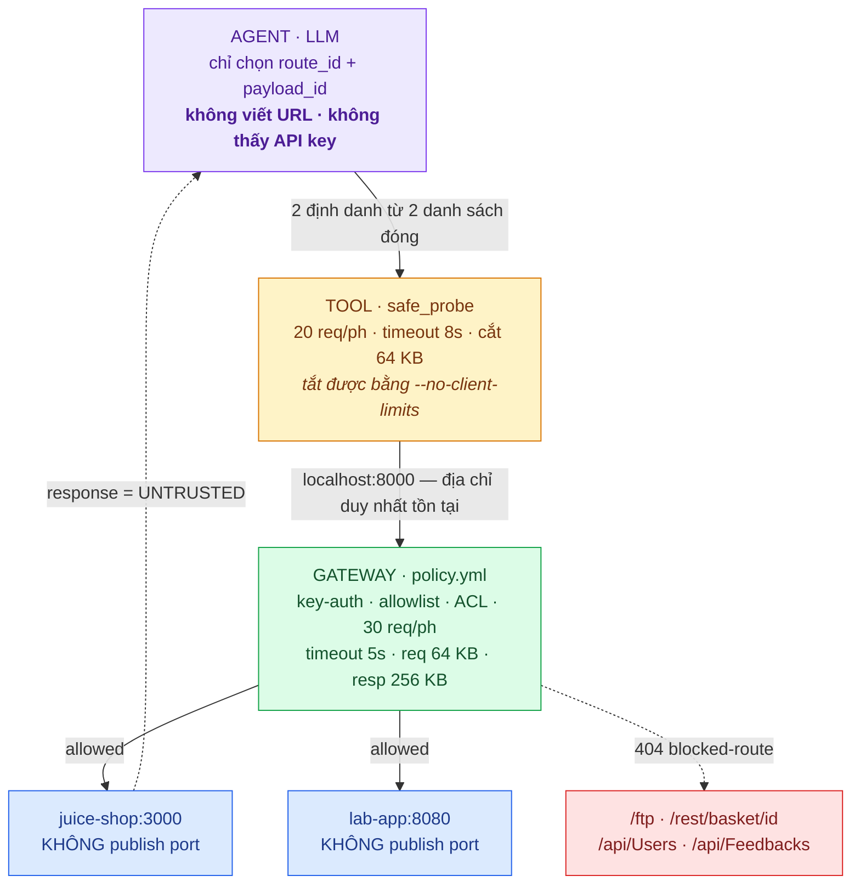

# Track 0 — API Gateway đặt trước ứng dụng thử nghiệm, và một công cụ chỉ biết đúng một địa chỉ

Toàn bộ transcript: [reports/evidence/](evidence/) · Bảng suite đầy đủ: [reports/suite-results.md](suite-results.md)

---

## Mục lục

1. [Kiến trúc và kết quả](#1-kiến-trúc-và-kết-quả)
2. [Gateway: chính sách là dữ liệu, code là generic](#2-gateway-chính-sách-là-dữ-liệu-code-là-generic)
3. [14 kiểm soát và bằng chứng từng cái](#3-14-kiểm-soát-và-bằng-chứng-từng-cái)
4. [Công cụ Python: lỗi là một kết quả có kiểu](#4-công-cụ-python-lỗi-là-một-kết-quả-có-kiểu)
5. [Payload an toàn — và một quan sát ngoài dự kiến](#5-payload-an-toàn--và-một-quan-sát-ngoài-dự-kiến)
6. [Lớp Agent đặt lên trên](#6-lớp-agent-đặt-lên-trên)
   - [6.1. Agent được quyết định cái gì](#61-agent-được-quyết-định-cái-gì)
   - [6.2. Kết quả chạy](#62-kết-quả-chạy)
   - [6.3. Chi phí](#63-chi-phí)
7. [Nhật ký: redaction đặt ở sink](#7-nhật-ký-redaction-đặt-ở-sink)
8. [Tuần 4 khác tuần 3 ở đâu](#8-tuần-4-khác-tuần-3-ở-đâu)
9. [Kết luận](#9-kết-luận)

---

## 1. Kiến trúc và kết quả

Tuần 3 kết thúc bằng một agent tự gửi HTTP request, với allowlist đặt trong
`llm/agent.py::_build_url` — **cùng tiến trình** với thứ đang đọc response của
target vào prompt của chính nó. Báo cáo tuần 3 đã ghi rõ vì sao điều đó yếu:
prompt là thứ có thể bị chính nó thuyết phục.

Tuần 4 trả lời lại câu hỏi đó: **guardrail chuyển ra ngoài tiến trình, và được
chứng minh bằng topology chứ không bằng code.**



**Tím = agent đề xuất. Vàng = công cụ, lịch sự nhưng tắt được. Xanh lá = gateway,
tiến trình khác, không tắt được. Đỏ = ngoài allowlist.**

| Lớp | Ai thực thi | Tắt được không | Chống được gì |
| --- | --- | --- | --- |
| Prompt ("chỉ gửi payload an toàn") | model | model tự tắt | gần như không gì |
| Danh sách đóng trong `plan.py` | code công cụ | sửa code là xong | model bị injection |
| Giới hạn client (`limits.py`) | code công cụ | `--no-client-limits` | công cụ cấu hình sai |
| **Policy gateway** | tiến trình khác | **không** | công cụ bị sửa, bị inject |
| **Topology** | Docker | **không**, trừ khi sửa compose | mọi thứ ở trên cùng lúc |

Lớp trên cùng có mặt vì nó rẻ và giúp model làm việc tốt hơn. Nó **không** được
tính là kiểm soát an ninh, và báo cáo này không nói ngược lại.

### Bằng chứng ngắn nhất của cả tuần

```bash
$ curl --max-time 2 http://localhost:3000/
curl: (7) Failed to connect to localhost port 3000: Connection refused
```

Juice Shop đang chạy và đang phục vụ. Nó chỉ **không có cổng nào ra host**: không
`ports:` trong `docker-compose.yml`, network khai báo `internal: true`. Trên host
không tồn tại địa chỉ nào dẫn tới nó.

Nên "mọi request đều đi qua gateway" là **tính chất của môi trường**, không phải
một quy ước mà công cụ được tin là sẽ tuân thủ. Nó vẫn đúng kể cả khi `client.py`
bị sửa để trỏ thẳng vào target, kể cả khi có người chạy `curl` bằng tay, kể cả
khi lớp LLM bị prompt injection — không cái nào trong ba trường hợp đó có gì để
kết nối tới.

`scripts/up.sh` tự kiểm tra điều này ở bước cuối và **exit 1** nếu port bị hở.
Bằng chứng: [evidence/01-no-direct-access.txt](evidence/01-no-direct-access.txt).

### Kết quả tổng

| | |
| --- | --- |
| Kiểm soát gateway được chứng minh bằng `curl` | **14 / 14 pass** |
| Request payload an toàn đã gửi (`probe suite`) | **72** — 22 payload × 9 route |
| Test tự động | **112 pass** |
| Endpoint tuần 3 khai thác được, nay không tới được | **2** — `/ftp`, `/rest/basket/{id}` |
| Probe do LLM đề xuất / bị từ chối vì id không hợp lệ | **12 / 0** |
| API key xuất hiện trong nhật ký | **0** |

Phân bố quyết định trong nhật ký gateway (360 dòng, toàn bộ phiên chạy):

| Quyết định | Số lần | |
| --- | --- | --- |
| `allowed` | 263 | request hợp lệ, được proxy |
| `rate-limited` | 51 | 429 |
| `blocked-route` | 15 | 404, ngoài allowlist |
| `unauthorized` | 9 | 401 |
| `forbidden-group` | 8 | 403, thiếu ACL |
| `upstream-timeout` | 7 | 504 |
| `blocked-method` | 4 | 405 |
| `request-too-large` | 3 | 413 |

**97 request bị gateway từ chối.** Không cái nào tới được ứng dụng phía sau.

---

## 2. Gateway: chính sách là dữ liệu, code là generic

Đề bài cho phép Kong, Nginx hoặc gateway đơn giản. Chọn **tự viết bằng FastAPI**,
vì một mục cụ thể trong đề bài: **giới hạn kích thước response**. Kong OSS không
có plugin nào làm việc đó, Nginx cũng không có cách sạch sẽ; tự viết thì là 8
dòng trong vòng lặp stream. Nếu chọn Kong, mục đó sẽ phải ghi là "làm ở client" —
tức là không có ai thực thi cả, vì client chính là thứ đang bị kiểm thử.

Lo ngại đi kèm — tự viết thì guardrail có quay về cùng tiến trình không — được
xử lý bằng ba ràng buộc trong `AGENTS.md`: container riêng, `src/safe_probe/`
không được import `gateway/`, và target không publish port. Ràng buộc thứ ba mới
là thứ có hiệu lực, và nó không phụ thuộc vào việc gateway viết bằng gì.
Đánh đổi đầy đủ: [ADR 0001](../docs/adr/0001-gateway-tu-viet.md).

### Toàn bộ chính sách nằm trong một file 100 dòng

`gateway/app.py` là generic: nó biết *cách* thực thi một policy, không biết
policy nào. Mọi thứ là *quyết định* nằm trong `gateway/policy.yml`:

```yaml
limits:
  rate_per_minute: 30
  upstream_timeout_s: 5
  max_request_bytes: 65536      # 64 KB
  max_response_bytes: 262144    # 256 KB

consumers:
  - name: agent-tool
    key_env: PROBE_API_KEY      # tên biến môi trường, không phải giá trị
    groups: [probe]

routes:
  - {id: products-search, upstream: juice-shop, methods: [GET],  path: /rest/products/search, groups: [probe]}
  - {id: login,           upstream: juice-shop, methods: [POST], path: /rest/user/login,       groups: [probe]}
  - {id: metrics,         upstream: juice-shop, methods: [GET],  path: /metrics,               groups: [admin]}
  ...
```

9 route. Mọi path khác trả 404 — không có wildcard. Key không bao giờ nằm trong
file này, nên file commit lên được.

### Thứ tự kiểm tra, và vì sao nó là một quyết định

| # | Chặng | Mã | Vì sao ở vị trí này |
| --- | --- | --- | --- |
| 1 | Kích thước request | 413 | Trước khi đọc body — body quá lớn không bao giờ được buffer |
| 2 | API key | 401 | Người lạ không học được gì thêm |
| 3 | Allowlist | **404** | *Không phải 403* — không tiết lộ cái gì tồn tại |
| 4 | Method | 405 | Chỉ khi đã biết path nằm trong allowlist |
| 5 | ACL group | 403 | Người gọi đã biết, route đã biết → giấu là vô nghĩa |
| 6 | Rate limit | 429 | Kèm `Retry-After` tính từ token bucket |
| 7 | Proxy | 504 / 502 | |
| 8 | Cắt response | — | Cắt lúc stream |

Điểm số 3 đáng nói: 403 gián tiếp xác nhận "cái này tồn tại". Một người gọi ngoài
allowlist có thể dùng chính gateway để vẽ bản đồ thứ nằm sau nó. 404 không lộ gì.

Mọi phản hồi đều mang header `X-Gateway-Decision`. Không có nó, công cụ không
phân biệt được "gateway chặn" với "ứng dụng trả 404" — và một run không phân biệt
được hai thứ đó thì không chứng minh được gì.

---

## 3. 14 kiểm soát và bằng chứng từng cái

`scripts/smoke.sh` chạy hoàn toàn bằng `curl`, **không qua công cụ Python**. Lý do:
công cụ có giới hạn riêng của nó, nên một 429 nhìn thấy qua công cụ không chứng
minh gì về gateway. `curl` không tuân thủ gì cả — thứ gì từ chối request ở đây thì
đó chính là gateway.

| # | Kiểm soát | Kết quả | Bằng chứng |
| --- | --- | --- | --- |
| 1 | Target không tới được từ host | `Connection refused` ×2 | [01](evidence/01-no-direct-access.txt) |
| 2 | Đường đi hợp lệ | `200` + `X-Gateway-Route: products` | [02](evidence/02-allowed-200.txt) |
| 3 | `/ftp` — **tuần 3 TP-4** | `404 blocked-route` | [03](evidence/03-blocked-ftp.txt) |
| 4 | `/rest/basket/1` — **tuần 3 TP-5** | `404 blocked-route` | [04](evidence/04-blocked-basket.txt) |
| 5 | `/api/Users` | `404 blocked-route` | [05](evidence/05-blocked-users.txt) |
| 6 | Không có key | `401 unauthorized` | [06](evidence/06-no-key-401.txt) |
| 7 | Key sai | `401 unauthorized` | [07](evidence/07-wrong-key-401.txt) |
| 8 | Sai method | `405 blocked-method` | [08](evidence/08-method-405.txt) |
| 9 | Thiếu ACL group | `403 forbidden-group` | [09](evidence/09-forbidden-403.txt) |
| 10 | Request 128 KB (cap 64 KB) | `413 request-too-large` | [10](evidence/10-request-413.txt) |
| 11 | Upstream chậm 9s (cap 5s) | `504 upstream-timeout` | [11](evidence/11-upstream-timeout-504.txt) |
| 12 | Response 500 KB (cap 256 KB) | nhận đúng **262 144 B** | [12](evidence/12-response-truncated.txt) |
| 13 | 45 request liên tiếp (cap 30/ph) | **29× 200, 16× 429** + `Retry-After: 2` | [13](evidence/13-rate-limit-429.txt) |
| 14 | Nhật ký gateway không chứa key | grep → không có | [14](evidence/14-gateway-log-clean.txt) |

**14 pass, 0 fail.**

Kiểm tra 11–13 cần một upstream chịu trả lời chậm 9 giây và trả về đúng 500 KB —
Juice Shop không làm được, nên `lab-app` (~80 dòng: `/slow?ms=`, `/big?kb=`,
`/echo`) tồn tại để "504 đến từ timeout" và "body cắt đúng cap" là *nhìn thấy*
chứ không phải *suy ra*.

### Chứng minh lớp nào đang gánh việc

`--no-client-limits` tắt sạch rate limit và size cap phía công cụ:

```
$ probe --no-client-limits get /ftp
block GET  /ftp                    404 blocked        65B    10ms
      gateway decision: blocked-route

$ probe --no-client-limits get /metrics
      GET  /metrics                403 forbidden      69B    10ms
      gateway decision: forbidden-group
```

Không đổi gì. Cờ này tồn tại để chứng minh, không phải để tiện — nếu không có nó,
báo cáo sẽ không phân biệt được lớp nào đang có tác dụng.
[evidence/16](evidence/16-no-client-limits-still-blocked.txt).

---

## 4. Công cụ Python: lỗi là một kết quả có kiểu

Đề bài yêu cầu công cụ xử lý được timeout và lỗi kết nối. Khẳng định đáng giá
không phải "nó không crash", mà **nó phân biệt được các loại thất bại** — một run
không phân biệt được "gateway từ chối" với "không có ai lắng nghe" thì không phải
bằng chứng của điều gì. Nên không có gì raise; mọi thứ trả về `ProbeResult` kèm
một `outcome`:

| `outcome` | Từ đâu | Ví dụ quan sát được |
| --- | --- | --- |
| `ok` | 2xx từ ứng dụng | `200` |
| `blocked` | `X-Gateway-Decision: blocked-route` | `/ftp` |
| `blocked_method` | `blocked-method` | `POST /api/Products` |
| `forbidden` | `forbidden-group` | `/metrics` |
| `unauthorized` | `unauthorized` | key sai |
| `rate_limited` | `rate-limited` | 429 |
| `too_large` | `request-too-large` | 413 |
| `upstream_timeout` | `upstream-timeout` | `/slow?ms=9000` |
| `upstream_client_error` / `upstream_server_error` | 4xx/5xx của ứng dụng | `401` login sai |
| `timeout` | socket timeout phía công cụ | `--timeout 0.3` |
| `connection_error` | refused / DNS fail | gateway chưa chạy |
| `refused_by_client` | giới hạn client chặn trước khi gửi | body > 32 KB |
| `scope_violation` | path không phân giải về gateway | `//evil.example/x` |

Trường `answered_by` tách riêng: `upstream` | `gateway` | `none`. Trong 72 case
của suite: **70 upstream, 2 gateway, 0 unknown** — tức mọi phản hồi đều mang
`X-Gateway-Decision`, và công cụ luôn biết ai đã trả lời.

### Hai lớp giới hạn, và con số duy nhất đi ngược chiều

| | Công cụ | Gateway |
| --- | --- | --- |
| Rate | 20/phút | 30/phút |
| Request size | 32 KB | 64 KB |
| Response size | 64 KB | 256 KB |
| Timeout | **8 s** | **5 s** |

Mọi giới hạn client đều *thấp hơn* để lớp client chạm trước và cư xử tử tế. Trừ
timeout: công cụ phải chờ **lâu hơn** gateway, nếu không một upstream chậm luôn
sinh ra timeout phía client — và kết quả đó không nói gì về gateway.

> **Nguyên tắc:** giới hạn nào muốn chứng minh thì phải để nó chạm trước.

### Công cụ *học* allowlist thay vì *mang theo* allowlist

`ProbeClient.routes()` gọi `GET /_gateway/routes`; công cụ không giữ bản sao nào
của policy. Hệ quả có chủ đích: nó có thể **đoán sai** — gửi `/ftp` và nhận 404.
Đó là cách đúng để phát hiện route không tồn tại, thay vì tự kiểm tra bằng một
danh sách sẽ lệch khỏi gateway sớm hay muộn.

Vẫn giữ thêm lớp phòng thủ kiểu tuần 3: `_build_url` ghép path rồi **parse lại và
kiểm tra `netloc`** — kiểm tra sau khi ghép chứ không khớp mẫu trên input, vì
`//evil.example/x` trông cũng như một path.

---

## 5. Payload an toàn — và một quan sát ngoài dự kiến

Đề bài liệt kê payload được phép và bị cấm. Cách mặc định — viết danh sách rồi
ghi trong README rằng chúng an toàn — hỏng dần: danh sách sẽ được sửa, người sau
thêm một chuỗi "để thử xem sao", README không đổi, và tài liệu bắt đầu nói dối.
Nên "an toàn" ở đây được định nghĩa bằng regex và bắt test quét ngược:

| Loại | Payload | Hỏi ứng dụng điều gì |
| --- | --- | --- |
| Chuỗi dài (3) | `A`×1024, `A`×10000, `é`×2000 | có giới hạn độ dài không; ký tự ≠ byte |
| Ký tự đặc biệt (7) | punctuation, nháy, whitespace, emoji, RTL, zero-width, combining | escape hay nối chuỗi |
| Rỗng (3) | `""`, `null`, `"   "` | field có thật sự bắt buộc không |
| Sai kiểu (5) | `12345`, `1.5`, `true`, `["a"]`, `{...}` | validate hay ép kiểu |
| Biên (4) | `0`, `-1`, `2^63`, `1e308` | tràn số |

**22 payload, 11 lớp bị cấm** (`sql-injection`, `xss`, `path-traversal`,
`command-injection`, `template-injection`, `jndi`, `xxe`, `nosql-operator`,
`header-injection`, `null-byte`, `ssrf-url`).

Ba khẳng định được test, và cả ba đều cần: (1) mọi payload vượt qua toàn bộ
pattern; (2) **mỗi pattern bắt được ít nhất một chuỗi tấn công thật** — một regex
không bao giờ khớp gì vẫn làm (1) xanh mà không bảo vệ gì cả; (3) `check_safe`
chạy lại **tại thời điểm dùng**, không chỉ khi viết catalogue.

Khẳng định (2) trả tiền ngay: nó tìm ra **hai lỗi thật** mà đọc code không thấy —
`as_text` dùng `repr()` nên chuỗi CRLF header-injection biến thành hai ký tự `\`
và `r` rồi lọt qua pattern `[\r\n]`; và `\$ne\s*:` không khớp `{"$ne": null}` vì
giữa `$ne` và `:` có dấu nháy kép.
[ADR 0004](../docs/adr/0004-payload-an-toan-la-bat-bien.md).

### Ranh giới "không thay đổi dữ liệu thật"

Payload an toàn chưa đủ — payload vô hại gửi tới `POST /api/Feedbacks` vẫn tạo
bản ghi thật. Ràng buộc thứ hai nằm ở allowlist: chỉ 2 route nhận method ghi —
`POST /rest/user/login` (credential sai → 401, không ghi gì) và `POST /echo`
(phản chiếu, không lưu) — và `test_no_route_can_write_real_data` khẳng định điều
đó tự động. `INJECTION_POINTS`, chỗ nhét payload vào từng route, được **viết
tay**: đoán chỗ nhét payload chính là cách một công cụ "an toàn" vô tình POST vào
một endpoint có ghi.

### Kết quả suite

72 request. Phân bố:

| Outcome | Số lượng | Nghĩa |
| --- | --- | --- |
| `ok` | 46 | 2xx từ ứng dụng |
| `upstream_client_error` | 22 | 4xx — phần lớn là `401` của login với credential sai kiểu |
| `upstream_server_error` | **2** | **cả hai đều là `special-quotes`** |
| `forbidden` | 1 | `/metrics`, gateway chặn |
| `upstream_timeout` | 1 | `/slow?ms=9000` |

Juice Shop chấp nhận gần như mọi thứ mà không lỗi — chuỗi 10 KB, emoji, chữ
Ả Rập, `null`, số nguyên nơi cần email — và trả `401` bình thường. Kết quả tốt
cho ứng dụng, ở mọi payload **trừ hai ký tự nháy**.

### Quan sát: payload an toàn vẫn lộ ra lỗi xử lý input

Payload `special-quotes` là đúng hai ký tự: `"` và `'`. Không `OR`, không `UNION`,
không comment SQL, không dấu chấm phẩy. Nó vượt qua cả 11 pattern.

```
GET /rest/products/search?q=%22%27
HTTP 500
<title>Error: SQLITE_ERROR: unrecognized token: ""'%') AND deletedAt IS NULL) ORDER BY name"</title>
```

Câu SQL nguyên văn nằm trong thẻ `<title>` của trang lỗi. `POST /rest/user/login`
cũng trả `500` với cùng payload.

**Ý nghĩa.** Tuần 3 đã kết luận endpoint này có SQL injection và đã chứng minh
bằng khai thác thật (TP-2: dump được bảng `Users`). Điều tuần 4 thêm vào là một
điểm về *phương pháp*: **cùng một lớp lỗ hổng phát hiện được bằng payload không
hề mang tính khai thác.** Hai ký tự nháy đủ để thấy input chưa qua kiểm tra đã đi
thẳng tới lớp SQL, cộng thêm một lỗi information disclosure — câu truy vấn lộ ra
trong trang lỗi.

Đây vẫn là một **quan sát**, chưa phải finding. Nó cần một người kết luận nó
nghĩa là gì, đúng như quy trình tuần 3.
[evidence/15](evidence/15-safe-payload-500.txt).

---

## 6. Lớp Agent đặt lên trên

### 6.1. Agent được quyết định cái gì

Đề bài mở đầu bằng "cho phép Agent đề xuất và gửi một số request kiểm thử an
toàn". Câu hỏi đi kèm là câu hỏi tuần 3: **agent được quyết định cái gì?** Nếu để
model tự viết URL và payload thì mọi thứ ở trên vô nghĩa — nó đọc response của
Juice Shop, một ứng dụng cố tình thù địch, và có thể bị chính response đó thuyết phục.

**Quyết định: model chỉ trả về hai định danh, từ hai danh sách đóng.**

```
route_id     phải có trong kết quả GET /_gateway/routes
payload_id   phải có trong payloads.SAFE_PAYLOADS
```

Nó **không** viết URL, **không** đặt header, **không** chọn method, **không** bao
giờ nhìn thấy API key. `_send()` là chỗ duy nhất một URL được tạo ra, và không có
gì từ model đi vào path, method hay header — model chọn một dòng, hàm đó đọc dòng.

Điều xấu nhất một model bị prompt injection làm được: chọn một route khác trong
allowlist và một payload khác trong catalogue. Tức là một request mà công cụ vốn
đã sẵn sàng gửi.

Ba lớp kiểm tra, không phải một:

1. `_validate()` từ chối id lạ và **prompt lại model kèm lý do** — không raise,
   vì một model chọn sai id thì nên được sửa chứ không nên làm hỏng cả run.
2. `payloads.get()` chạy lại `check_safe()` tại thời điểm dùng.
3. Gateway vẫn có quyền từ chối, kể cả khi hai lớp trên đều nhầm.

### 6.2. Kết quả chạy

`probe plan --goal "input validation on the allowlisted endpoints" --rounds 2`,
model `deepseek-v4-pro`.

| | |
| --- | --- |
| Probe được đề xuất và gửi | **12** |
| Bị từ chối trước khi gửi (id không hợp lệ) | **0** |
| Route model chạm tới | `products-search`, `login`, `echo`, `slow`, `big` |
| Payload khác nhau model chọn | 10 / 22 |
| Route ngoài allowlist model chạm tới | **0 — không có cách nào** |
| Kết quả | 8× `ok`, 4× `upstream_client_error` |

Trích vài đề xuất, cho thấy nó đang suy nghĩ về *validation* chứ không về khai thác:

| Route + payload | Lý do model đưa ra | Kết quả |
| --- | --- | --- |
| `login` + `wrong-type-object` | *"Check if the login endpoint gracefully handles an object payload instead of a string"* | `401` |
| `slow` + `boundary-negative` | *"Probe whether a negative sleep duration is rejected or accepted"* | `200` |
| `big` + `boundary-int64` | *"Validate that an extremely large kb value is handled, preventing integer overflow"* | `200` |
| `products-search` + `empty-string` | *"Test if the search endpoint accepts an empty query, potentially returning all products"* | `200` |

Vòng 2 có đưa kết quả vòng 1 trở lại context — đó là thứ làm vòng 2 đáng có, và
cũng là đường prompt-injection duy nhất còn lại. Prompt nói rõ mọi response là dữ
liệu không tin cậy, nhưng đó là biện pháp yếu và **không phải** thứ đang giữ an
toàn. Thứ đang giữ an toàn là danh sách đóng.

[evidence/17-llm-plan-run.json](evidence/17-llm-plan-run.json) ·
[ADR 0002](../docs/adr/0002-guardrail-hai-lop.md).

### 6.3. Chi phí

2 lượt gọi, **2 073 token input + 3 408 output**, 59 giây. Rẻ hơn tuần 3 hai bậc
độ lớn (79 lượt, 219k in / 75k out) — vì model không đọc response đầy đủ, nó chỉ
đọc hai danh sách và một bản tóm tắt đã cắt.

Mọi lượt gọi được ghi vào `data/llm/calls.jsonl` kèm **hash của prompt**, model và
usage. Một thành phần không tất định chỉ được đứng cạnh báo cáo này nếu cái nó
được hỏi có thể đọc lại sau.

---

## 7. Nhật ký: redaction đặt ở sink

Trường hợp khó không phải header `X-API-Key` — allowlist tên header bắt được nó.
Khó là key **quay lại trong response** từ ứng dụng phản chiếu input, hoặc lọt vào
query string, hoặc nằm trong một field thêm sau mà không ai nghĩ tới.

Nên redaction đặt ở **sink**: `AuditLog.write` là hàm duy nhất mở file log, và nó
quét **đệ quy** toàn bộ record. Một chỗ gọi phải *nhớ* redact là một chỗ gọi sẽ
*quên*, và cái quên đó im lặng — log trông vẫn bình thường cho tới lúc có người grep.

Ba lớp che, mỗi lớp bắt một kiểu rò rỉ: theo **tên header**, theo **giá trị đã
biết**, và theo **hình dạng** (regex bắt thứ trông giống credential mà repo chưa
từng biết). Lớp thứ ba là chỗ có lỗi thứ hai test tìm ra: regex ban đầu bắt buộc
có `:` hoặc `=` giữa từ khoá và giá trị, nên `Authorization: Bearer <token>` —
cách credential xuất hiện phổ biến nhất trong log — không khớp.

Test là deliverable thật, module chỉ là cách làm nó xanh:
`test_it_survives_an_application_that_reflects_the_key_back` gọi một stub cố tình
trả key về trong body, rồi grep file log.

Gateway có bản redaction **riêng**, không dùng chung code — hai thành phần không
được chia sẻ code, nếu không thì `src/safe_probe/` sẽ import được `gateway/`.

`scripts/verify.sh` grep key thật trong `data/` và `reports/` rồi chạy
`ggshield secret scan`. Kết quả: không có.
[evidence/14](evidence/14-gateway-log-clean.txt) · [methodology §7](../docs/methodology.md).

---

## 8. Tuần 4 khác tuần 3 ở đâu

| | Tuần 3 | Tuần 4 |
| --- | --- | --- |
| Guardrail nằm ở đâu | `_build_url` trong code agent | policy của một tiến trình khác + topology |
| Chứng minh bằng gì | đọc code | `curl localhost:3000` → refused |
| Agent quyết định gì | method, path, headers, body | 2 định danh từ 2 danh sách đóng |
| Payload | injection thật (SQLi, XSS, null byte) | chỉ an toàn, có test bảo vệ |
| Mục tiêu | khai thác được hay không | có validate hay không |
| Ground truth | Score Board Juice Shop tự chấm | mã lỗi của gateway + transcript |
| Số lượt gọi LLM | 79 (219k in / 75k out) | 2 (2k in / 3.4k out) |

Điểm nối rõ nhất: **hai lỗ hổng tuần 3 khai thác được mà cả ZAP lẫn sqlmap đều bỏ
sót — `/ftp` và `/rest/basket/{id}` — nay không tới được nữa.**

Không phải vì công cụ từ chối gửi. Công cụ **có** gửi. Gateway trả lời `404`.

---

## 9. Kết luận

**Được:**

- Guardrail chuyển từ trong tiến trình ra ngoài tiến trình, và chứng minh được
  bằng `Connection refused` thay vì bằng cách đọc code. Đây là điều tuần 3 để lại
  và tuần 4 giải quyết.
- 14/14 kiểm soát gateway chứng minh bằng `curl` — không qua công cụ, nên kết quả
  nói về gateway chứ không nói về công cụ.
- 97 request bị gateway từ chối trong phiên chạy, không cái nào tới ứng dụng.
- "Payload an toàn" và "log không lưu key" biến thành **bất biến có test**, không
  còn là lời hứa trong README. Chính hai bộ test đó tìm ra hai lỗi thật mà đọc
  code không thấy.
- Agent chỉ quyết định 2 định danh từ 2 danh sách đóng: 12 probe, 0 bị từ chối,
  0 cách chạm tới endpoint ngoài allowlist.
- Phát hiện được: payload an toàn tuyệt đối (hai dấu nháy) vẫn đủ lộ ra lớp lỗ
  hổng mà tuần 3 phải khai thác mới thấy.

**Chưa được:**

- **Chưa test prompt injection thật** — vẫn là mục còn nợ từ tuần 3. Repo lập
  luận rằng thiệt hại bị chặn ở danh sách đóng, nhưng chưa có run nào cố tình
  nhồi chỉ thị vào response để đo.
- **Gateway là code tự viết, chưa ai audit.** Nó chứng minh policy được thực thi
  *ở đâu*, không chứng minh phần thực thi đó không có lỗ hổng. Kong có nhiều người
  soi hơn; đây là cái giá đã chọn trả để đổi lấy giới hạn response size.
- **Rate limit chỉ đúng với một worker.** Bucket giữ trong bộ nhớ; hai worker sẽ
  âm thầm nhân đôi giới hạn thật. `Dockerfile` hard-code `--workers 1`, nhưng đó
  là ràng buộc bằng comment, không phải bằng kiểm tra.
- **API key không hết hạn, không xoay vòng.** Đủ cho một công cụ nội bộ, không đủ
  cho gì khác.
- **Catalogue 22 payload không phải là đủ.** Nó không bao phủ hết các cách một
  ứng dụng xử lý input sai.
- **Chỉ một model** (`deepseek-v4-pro`), một lượt chạy, một goal. Chưa đo được
  tính ổn định như tuần 3 đã làm với agent loop.
