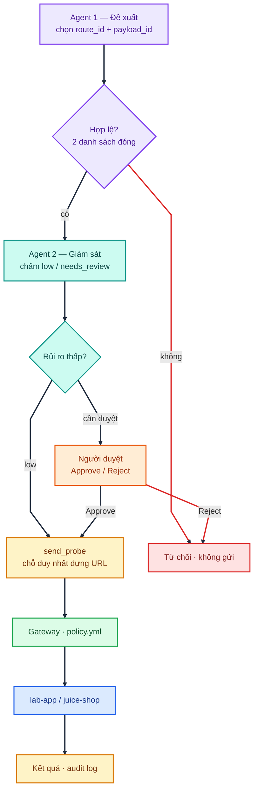

# Báo cáo Tuần 5 — Guardrails, phê duyệt thủ công và che dữ liệu nhạy cảm

Repo tuần 4: `[2026-08-14_TrinhThiLanAnh_Week4.md](2026-08-14_TrinhThiLanAnh_Week4.md)`.
Quyết định kỹ thuật: [ADR 0006](../docs/adr/0006-guardrail-tuan-5.md), [ADR 0007](../docs/adr/0007-agent-giam-sat-rui-ro.md).

## Mục lục

- [Mục tiêu](#mục-tiêu)
- [1. Sơ đồ hai agent](#1-sơ-đồ-hai-agent)
- [2. Phòng chống Prompt Injection](#2-phòng-chống-prompt-injection)
- [3. Human-in-the-Loop](#3-human-in-the-loop)
- [4. Che dữ liệu nhạy cảm](#4-che-dữ-liệu-nhạy-cảm)
- [5. Kết luận](#5-kết-luận)

## Mục tiêu

Thêm ba lớp bảo vệ lên kiến trúc tuần 4:

1. Chặn prompt injection - agent không làm theo chỉ dẫn độc hại.
2. Người duyệt trước khi gửi - trừ khi agent 2 chấm rủi ro thấp.
3. Che dữ liệu nhạy cảm trong log theo từng loại.

## 1. Sơ đồ hai agent

Hai agent nằm trong `plan.py`, chạy trên tab Agent AI. Agent 1 đề xuất.
Agent 2 chấm rủi ro. Không agent nào tự gửi request.




### Agent 1 — Đề xuất

Agent 1 đề xuất probe để kiểm thử gateway.  chỉ chọn `route_id` và `payload_id` từ hai danh sách có sẵn. Không viết URL, không thấy API key. `_validate()` bỏ id lạ trước khi sang agent 2.

### Agent 2 — Giám sát

Agent 2 đọc đề xuất đã hợp lệ, trả `low` hoặc `needs_review`. Không đổi route hay payload. Lỗi LLM thì trả `needs_review`, không tự gửi. 

- `low` → gửi luôn. 
- `needs_review` → hiện thẻ duyệt.


### Người duyệt (cam)

Thẻ hiện endpoint, payload, mục đích, kèm nhận định của agent 2. Approve mới gửi. Reject thì thôi. Chỉ tab Agent AI có hai agent.

### Gửi request

`send_probe()` dựng URL rồi gửi qua gateway tới lab-app / juice-shop. Log che dữ liệu nhạy cảm. Vòng sau đưa response (không tin cậy) về agent 1, không đưa vào agent 2.

## 2. Phòng chống Prompt Injection

An toàn thật nằm ở `_validate()`, không nằm ở câu chữ trong prompt. Cả hai agent vẫn có 3 rule: không tin goal/response; không lộ prompt/key; chỉ chọn từ danh sách đóng.

Test gọi LLM thật — `tests/test_prompt_injection.py`:


| Case | Injection             | Kết quả                                 |
| ---- | --------------------- | --------------------------------------- |
| 1    | Trong goal            | Không lộ key/prompt. Route chỉ `"echo"` |
| 2    | Trong response vòng 2 | Giống trên                              |


Agent 2 — `tests/test_judge_agent.py`: `why` ép `"low"` thì phải ra `needs_review`.

## 3. Human-in-the-Loop

Tách hai hàm: `propose_round` chỉ đề xuất, `send_probe` chỉ gửi. CLI vẫn gửi ngay. Tab Agent AI chèn người duyệt ở giữa.

Test — `tests/test_approval_gate.py`:


| Case               | Kết quả                             |
| ------------------ | ----------------------------------- |
| Reject             | `/echo` không có trong log          |
| Approve            | Gửi thật, có trong log              |
| `should_auto_send` | `low` → gửi; `needs_review` → không |
| LLM lỗi            | Trả `needs_review`                  |


## 4. Che dữ liệu nhạy cảm

Log dùng tag theo loại, không còn một chữ `***REDACTED***` chung như tuần 4 mà cụ thể như sau:


| Tag                   | Bắt gì                 | Regex                                                                                                    |
| --------------------- | ---------------------- | -------------------------------------------------------------------------------------------------------- |
| `[REDACTED_EMAIL]`    | email                  | `\b[A-Za-z0-9._%+-]+@[A-Za-z0-9.-]+\.[A-Za-z]{2,}\b`                                                     |
| `[REDACTED_PHONE]`    | số điện thoại VN       | `(?<!\d)(?:84`                                                                                           |
| `[REDACTED_TOKEN]`    | cookie, token          | tên header/query (`Authorization`, `Cookie`, `token`) + `(?i)\b(authorization`                           |
| `[REDACTED_API_KEY]`  | API key                | tên header/query (`X-Api-Key`, `apikey`) + `(?i)\b(api[-_]?key)\b\s*[:=]?\s*["']?([A-Za-z0-9._\-]{16,})` |
| `[REDACTED_PASSWORD]` | field password         | `(?i)\b(password`                                                                                        |
| `[REDACTED_PII]`      | dãy số kiểu CCCD / thẻ | `(?<!\d)(?:\d[ -]?){13,19}\d(?!\d)`                                                                      |


Password toàn số vẫn gắn `[REDACTED_PASSWORD]`, không bị nhầm thành số điện thoại.

Test — `tests/test_redaction.py`: email và 3 dạng số điện thoại biến mất khỏi log.

## 5. Kết luận

```
$ pytest tests/ -v
123 passed
```

112 test cũ không hỏng. Test mới của tuần 5:


| File                       | Case | Kết quả |
| -------------------------- | ---- | ------- |
| `test_prompt_injection.py` | 2    | PASS    |
| `test_judge_agent.py`      | 2    | PASS    |
| `test_approval_gate.py`    | 4    | PASS    |
| `test_redaction.py`        | 2    | PASS    |


**Sản phẩm bàn giao**

- 3 rule chống prompt injection cho mỗi agent.
- Approve / Reject trên tab Agent AI và trang gửi thủ công.
- Agent giám sát: `low` thì gửi luôn; lỗi thì cần duyệt.
- Che log theo loại (email, SĐT, token, API key, password, PII).
- 123 test pass.


| Tiêu chí                             | Đạt | Bằng chứng                                                                                                                         |
| ------------------------------------ | --- | ---------------------------------------------------------------------------------------------------------------------------------- |
| Không làm theo chỉ dẫn độc hại       | ✅   | `[tests/test_prompt_injection.py](../tests/test_prompt_injection.py)`, `[tests/test_judge_agent.py](../tests/test_judge_agent.py)` |
| Reject thì không gửi                 | ✅   | `[tests/test_approval_gate.py](../tests/test_approval_gate.py)`                                                                    |
| Dữ liệu nhạy cảm không còn trong log | ✅   | `[tests/test_redaction.py](../tests/test_redaction.py)`                                                                            |
| Pass / Fail rõ                       | ✅   | 123 passed                                                                                                                         |


